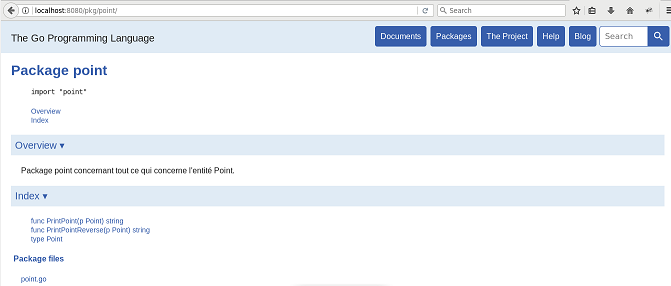

# Carte de référence du langage Go

## Sommaire

1. [Bases du langage](#bases)
    1. [Briques du langage](#briques)
        1. [Variable](#variable)
        2. [Constante](#constante)
        3. [Type](#type)
        4. [Import](#import)
        5. [Pointeur](#pointeur)
    2. [Boucle](#boucle)
    3. [Instructions de branchement conditionnel](#branch_condition)
        1. [Condition](#condition)
        2. [Switch](#switch)
    4. [Instructions de branchement non conditionnel](#branch_non_condition)
        1. [Break](#break)
    5. [Collections](#collections)
        1. [Tableau](#tableau) 
        2. [Slice](#slice)
        3. [Map](#map)
    6. [Opérations sur les collections](#ope_collections)
        1. [len()](#len)
        2. [append()](#append)
        3. [copy()](#copy)
        4. [delet()](#delete)
        5. [identificateur `_`](#identificateur)
        6. [range](#range)
    7. [Structure](#structure)
    8. [Appels de suites d'opérations](#appel_suites_operations)
        1. [Fonction](#fonction)
        2. [Méthode](#methode)
        3. [Interface](#interface)
    9. [Ligne de commande et Arguments](#ligne_commande)
2. [Bibliothèques du langage Go](#biblio)
    1. [Principales bibliothèques standards](#standards)
        1. [Bibliothèque `fmt`](#fmt)
        2. [Bibliothèque `errors`](#errors)
        3. [Bibliothèque `os`](#os)
        4. [Bibliothèque `io`](#io)
        5. [Bibliothèque `strings`](#strings)
        6. [Bibliothèque `time`](#time)
    2. [Principales bibliothèques tierces](#tierces)
        1. [Bibliothèque `debug`](#debug)
        2. [Bibliothèque `mobile`](#mobile)
3. [Outils de développement](#outils)
    1. [Présentation](#presentation)
    2. [Commandes](#commandes)
    3. [Compilation](#compilation)
    4. [Tests unitaires](#tests)
    5. [Documentation](#documentation)

4. [Ressources d'apprentissage](#ressources)


## Bases du langage <a id="bases"></a> 

### Briques du langage <a id="briques"></a> 

#### Variable <a id="variable"></a> 

Une déclaration permet de créer une [variable](https://golang.org/ref/spec#Variables) modifiable à tout moment. 
    
```go
var a int = 1
fmt.Println(a)

// ou directement

b := 1
fmt.Println(b) 
```

Pour exécuter l'exemple : [Playground](https://play.golang.org/p/fXhZj0Klfl5)


#### Constante <a id="constante"></a> 

Une [constante](https://golang.org/ref/spec#Constants) permet de déclarer un élément non modifiable.
    
```go
const pi float32 = 3.14
```

Pour exécuter l'exemple : [Playground](https://play.golang.org/p/In_myhSkJjF)


#### Type <a id="type"></a> 

Il existe plusieurs [types](https://golang.org/ref/spec#Types) en langage Go : 
- le type booléen `bool` prend 2 valeurs possibles : `true` ou `false`. 
- le type `string` représentant une chaîne de caractères. 
- le type entier non signé : `uint`, `uint8` (ou `byte` pour représenter l'octet), `uint16`, `uint32` et `uint64`.
- le type entier signé : `int`, `int8`, `int16`, `int32` (ou `rune` pour représenter un caractère unicode) et `int64`. 
- le type réel : `float32` et `float64`. 
- le type complexe : `complex64` et `complex128`

Les manipulations arithmétiques (`+`, `-`, `*`, `/`, `%`, `++` et `--`), relationnelles (`==`, `!=`, `>`, `<`, `>=` et `<=`) et binaires (`<<`, `>>`, `&`, `|`, `^`) fonctionnent en Go. 


#### import <a id="import"></a> 

Le mot clé [`import`](https://golang.org/ref/spec#Import_declarations) permet d'importer des modules tels que les bibliothèques standards (ex : `fmt`).
    
```go
import "fmt"
```

Pour exécuter l'exemple : [Playground](https://play.golang.org/p/9j-MiWXan-2)

#### Pointeur <a id="pointeur"></a> 

Un [pointeur](https://golang.org/ref/spec#Pointer_types) permet de faire des références sur des variables. Les pointeurs Go s'utilisent comme en langage C.
    
```go
func add (val *int){
    *val = *val + 1
}

func main() {
    var cal int = 2
    add(&cal)
    fmt.Println(cal)
}
```

Pour exécuter l'exemple : [Playground](https://play.golang.org/p/Wqvp7Xu9YUq)
    

### Boucle <a id="boucle"></a> 

Une [boucle](https://golang.org/ref/spec#For_statements) se fait avec le mot clé `for`. 
   
```go
for i := 0; i < 10; i++ {
    fmt.Println(i)
}

// ou bien 

i := 0 
for i < 10 {
    fmt.Println(i)
    i = i + 1
}
```

Pour exécuter l'exemple : [Playground](https://play.golang.org/p/lOZiv2GZ6gl)


### Instructions de branchement conditionnel <a id="branch_condition"></a> 

#### Condition <a id="condition"></a> 

Une [condition](https://golang.org/ref/spec#If_statements) permet de faire des instructions si la condition est vraie (`if`). On peut effectuer des instructions si la condition est fausse (`else`). Il est possible de faire une succession de tests avec `if/else if/.../else`.
    
```go
var a int = 3
if a < 0{
    fmt.Println(a, "negatif")
} else if a > 0 {
    fmt.Println(a, "positif")
} else {
    fmt.Println(a, "nul")
}
```

Pour exécuter l'exemple : [Playground](https://play.golang.org/p/fWHXKDPXkyu)


#### Switch <a id="switch"></a> 

[`switch`](https://golang.org/ref/spec#Switch_statements) permet de faire une succession de cas possibles au lieu de plusieurs tests successifs.
    
```go
a := 1
switch a%2 {
    case 0:Instructions de branchement non conditionnel
        fmt.Println("pair")
    case 1:
        fmt.Println("impair")
}
```

Pour exécuter l'exemple : [Playground](https://play.golang.org/p/3YV0JGZly9B)


### Instructions de branchement non conditionnel <a id="branch_non_condition"></a> 

#### Break <a id="break"></a> 

[`break`](https://golang.org/ref/spec#Break_statements) permet de sortir de la boucle dans laquelle se trouve l'instruction.
    
```go
for i:=0; i < 10; i++ {
    if i == 5 {
        break
    }
    fmt.Println(i)
}
```

Pour exécuter l'exemple : [Playground](https://play.golang.org/p/yxKc5C3hnFz)


### Collections <a id="collections"></a> 

#### Tableau <a id="tableau"></a> 

Un [tableau](https://golang.org/ref/spec#Index_expressions) permet de déclarer un ensemble fini (à une ou plusieurs dimensions) et ordonné de variables ayant le même type.
    
```go
var b [2] int
b[0]=0
b[1]=1

// ou directement 

b := [2]int{0, 1}
```

Pour exécuter l'exemple : [Playground](https://play.golang.org/p/sjUW6wQfXT9)


#### Slice <a id="slice"></a> 

`make` permet de déclarer une [slice](https://golang.org/ref/spec#Slice_expressions) (tableau dynamique) à une ou plusieurs dimensions.
    
```go
s := make([]string, 2)
s[0] = "a"
s[1] = "b"

// ou directement  

s := []string{"a", "b"}
```

Pour exécuter l'exemple : [Playground](https://play.golang.org/p/P2lsEJUNiaQ)

#### Map <a id="map"></a> 

Une [map](https://golang.org/ref/spec#Map_types) permet de stocker des valeurs en leur associant une clé.
    
```go
m := make(map[string]int)
m["mehdi"] = 1
m["clement"] = 2
```

Pour exécuter l'exemple : [Playground](https://play.golang.org/p/7xQS9cJFnhl)


### Opérations sur les collections <a id="ope_collections"></a> 

#### len() <a id="len"></a> 

`len()` permet de récupérer la taille d'un tableau, d'un string ou d'une slice.
    
```go
var a [2] int
fmt.Println(len(a))
```
Pour exécuter l'exemple : [Playground](https://play.golang.org/p/UwQd4cqGTYq)

#### append() <a id="append"></a> 

`append()` permet d'ajouter un élément à la slice.
    
```go
s := make([]string, 2)
s[0] = "a"
s[1] = "b"
s = append(s, "c") 
```
Pour exécuter l'exemple : [Playground](https://play.golang.org/p/uGLv_D6i6Gd)

#### copy() <a id="copy"></a> 

`copy()` permet de copier une slice dans une autre.
    
```go
s := make([]string, 2)
s[0] = "a"
s[1] = "b"
c := make([]string, len(s))
copy(c, s) 
```
Pour exécuter l'exemple : [Playground](https://play.golang.org/p/B5oC8EmkJKk)


#### delete() <a id="delete"></a> 

`delete()` permet de supprimer une valeur dans la map.
    
```go
m := make(map[string]int)
m["mehdi"] = 1
m["clement"] = 2
delete(m, "clement")
```
Pour exécuter l'exemple : [Playground](https://play.golang.org/p/O4WqofKVmm7)

#### identificateur _ <a id="identificateur"></a> 

Cet identificateur `_` permet de déclarer une variable que l'on veut ignorer. Ici, l'appel `m["clement"]` permet de savoir si une valeur ayant la clé "clement" est présente (true ou false pour la variable test1).
Le premier argument permet de récupérer sa position, or, dans notre exemple, il ne nous est pas utile : il est donc ignoré grâce à `_`. 
    
```go
m := make(map[string]int)
m["mehdi"] = 1
m["clement"] = 2
_, test1 := m["clement"] // test1 vaut true
_, test2 := m["inconnu"] // test2 vaut false
```
Pour exécuter l'exemple : [Playground](https://play.golang.org/p/BhEIqBnHRUm)

#### range <a id="range"></a> 

`range` permet d'itérer facilement dans une structure de tableau, de slice ou de map.
    
```go
tab := []int{1, 2, 3}
somme := 0
for _, val := range tab {
    somme += val
}
fmt.Println("Somme:", somme)
```
Pour exécuter l'exemple : [Playground](https://play.golang.org/p/XnrjmsWVemh)


### Structure <a id="structure"></a> 

Déclarer une [structure](https://golang.org/ref/spec#Struct_types) se fait avec le mot clé `struct`. Une structure est un nouveau type de variables possédant plusieurs champs.
    
```go
type etudiant struct {
    nom string
    num  int
}

func main() {
    e := etudiant{nom: "Clement", num: 21501810}
    fmt.Println(e)
}
```

Pour exécuter l'exemple : [Playground](https://play.golang.org/p/DVFLQEO4O42)


### Appels de suites d'opérations <a id="appel_suites_operations"></a> 

#### Fonction <a id="fonction"></a> 

Déclarer une [fonction](https://golang.org/ref/spec#Function_types) se fait avec le mot clé `func`. Une fonction peut avoir plusieurs retours.
    
```go
func calcul1 (val1 int, val2 int) int {
    return val1 + val2
}

func calcul2 (val1 int, val2 int) (int, int){
    return val1 + val2, val1 - val2
}

func main() {
    var test1, test2, test3 int = 0, 0, 0
    test1, test2 = calcul2(2,3)
    test3 = calcul1(1,2)
}
```

Pour exécuter l'exemple : [Playground](https://play.golang.org/p/6esO9svFjH7)


#### Méthode <a id="methode"></a> 

Une [méthode](https://golang.org/ref/spec#Method_declarations) correspond à une fonction déclarée pour une structure (hors de la déclaration de la structure). On peut la comparer aux méthodes du langage Java. 
    
```go
func (e etudiant) change_num (nouveau int) etudiant{
    e.num=nouveau
    return e
}

func main() {
    e := etudiant{nom: "Clement", num: 21501810}
    e = e.change_num(21500000)
    fmt.Println(e)
}
```

Pour exécuter l'exemple : [Playground](https://play.golang.org/p/dsDZ7ONTMP_2)


#### Interface <a id="interface"></a> 

Une [interface](https://golang.org/ref/spec#Interface_types) permet de regrouper des signatures de méthodes communes à plusieurs structures.
    
```go
type politesse interface {
    saluer() string
}

type francais struct {
    nom string
}

func (f francais) saluer() string {
    return "bonjour"
}

type anglais struct {
    name string
}

func (a anglais) saluer() string{
    return "hello"
}

func parler(p politesse) {
    fmt.Println(p.saluer())
}

func main() {
    angl := anglais{name: "James"}
    fran := francais{nom: "Jean"}
    parler(angl) // affiche "hello"
    parler(fran) // affiche "bonjour"
}
```

Pour exécuter l'exemple : [Playground](https://play.golang.org/p/3k2Grm3xwGW)


### Ligne de commande et Arguments <a id="ligne_commande"></a> 

Il est possible en langage Go de récupérer les arguments tapés par l'utilisateur lors d'un appel d'un programme. Dans l'exemple ci dessous, on va d'abord compiler avec `go build commandes.go`. Puis, on va exécuter le programme avec par exemple `./commandes test1 test2 test3`. Ici, commandeTotale sera `[./commandes test1 test2 test3]` et commandesSansAppelProgr sera `[test1 test2 test3]`. 

```go
// filename : commandes.go

package main

import "fmt"
import "os"

func main() {
    // os.Args récupére les différents mots constituant la commande
    commandeTotale := os.Args
    // os.Args[1:] récupère tous les mots sauf le premier (appel du programme)
    commandeSansAppelProgr := os.Args[1:]

    fmt.Println(commandeTotale)
    fmt.Println(commandeSansAppelProgr)
}
```
Pour exécuter l'exemple : [Playground](https://play.golang.org/p/STcdf9y1BRr)


## Bibliothèques du langage Go <a id="biblio"></a> 

### Principales bibliothèques standards <a id="standards"></a> 

#### Bibliothèque `fmt` <a id="fmt"></a> 

[`fmt`](https://golang.org/pkg/fmt/) est la bibliothèque permettant de gérer les entrées-sorties de l'utilisateur. En langage C, on peut donc la comparer à la bibliothèque `stdio.h`. 
On peut utiliser la fonction `Printf` pour faire un affichage "formaté" et `Scanf` pour récupérer l'entrée de l'utilisateur (le clavier par défaut).  

```go
package main

import "fmt"

func main() {
    test := 2
    fmt.Printf("test = %d \n", test)
    var entree int
    fmt.Scanf("%d", &entree)
    fmt.Printf("entree : %d\n", entree)
    /* 
        affiche "test = 2"
        puis attend l'entrée de l'utilisateur
        Si l'utilisateur écrit "3" alors l'affichage sera "entrée : 3"
    */
}
```

Pour exécuter l'exemple : [Playground](https://play.golang.org/p/s5GTQIBgsfc)

#### Bibliothèque `errors` <a id="errors"></a> 

Les erreurs [`errors`](https://golang.org/pkg/errors/) permettent de gérer les exceptions en langage Go.
    
```go
package main

import "fmt"
import "errors"

func verifie_positif (nombre float32){
    if(nombre < 0){
        // panic permet de sortir du programme et d'afficher l'exception lancée
        panic(errors.New("Ce nombre ne doit pas etre negatif"))
    }
}

func quotient (num float32, denom float32) (float32, error){
    if denom == 0 {
        return -1, errors.New("Erreur mathematique")
    }else {
        return num / denom, nil
    }
}

func main() {
    var c1 float32
    var err error
    var a1, b1 float32 = 1,2
    c1,err = quotient(a1, b1)
    fmt.Println(c1)
    fmt.Println(err)
    verifie_positif(12.0)
}
```

Pour exécuter l'exemple : [Playground](https://play.golang.org/p/iXRQ7ujdzjp)


#### Bibliothèque `os` <a id="os"></a> 

La bibliothèque [`os`](https://golang.org/pkg/os/) est très utile pour la gestion des processus, des ouvertures et fermetures de fichiers, la manipulation de dossiers et des permissions. 

Dans cet exemple, on ouvre en écriture le fichier `test_ouverture.txt` (crée un nouveau fichier s'il n'existe pas). Puis, on écrit dans le fichier pour enfin le fermer. 

```go
package main

import "fmt"
import "os"

func main() {
    f, err1 := os.OpenFile("test_ouverture.txt", os.O_WRONLY|os.O_CREATE, 0644)
    if err1 != nil {
        panic(err1)
    }
    nb_octets, err2 := f.WriteString("voici un test")
    if err2 != nil {
        panic(err2)
    }
    fmt.Println("Nb d'octets écrits dans le fichier : ", nb_octets)
    err3 := f.Close();
    if err3 != nil {
        panic(err3)
    }
}
```

Pour exécuter l'exemple : [Playground](https://play.golang.org/p/DrTAOAgrvvg)


#### Bibliothèque `io` <a id="io"></a> 

[`io`](https://golang.org/pkg/io/) est la bibliothèque permettant notamment d'interagir avec les fichiers. Il est donc possible de lire et d'écrire dans des fichiers. 
La différence avec `os` est le fait que `io` est plus "haut niveau" que `os` notamment avec la manipulation des fichiers. 

Dans cet exemple, on va lire en entier le fichier `test1.txt` et recopier son contenu dans le fichier `test1_copie.txt`. A noter que si le fichier `test1_copie.txt` n'existe pas, il le crée ; sinon, il l'écrase. 

```go
package main

import "io/ioutil"

func main(){

    donnees_copiees, err1 := ioutil.ReadFile("test1.txt")
    if err1 != nil {
        panic(err1)
    }

    donnees_a_recopier := []byte(string(donnees_copiees))
    err2 := ioutil.WriteFile("test1_copie.txt", donnees_a_recopier, 0644) // 0644 correspond aux permissions.
    if err2 != nil {
        panic(err2)
    }

}
```

Pour exécuter l'exemple : [Playground](https://play.golang.org/p/uQK5zoz95-y)


#### Bibliothèque `strings` <a id="strings"></a> 

[`strings`](https://golang.org/pkg/strings/) permet de gérer la manipulation de chaînes de caractères. Elle est comparable à la manipulation de string en langage Java. 

```go
package main

import "fmt"
import "strings"

func main() {
    // Count compte le nombre de sous-chaines ("ca") dans un string ("cacao")
    nb1 := strings.Count("cacao", "ca")
    fmt.Println("Il y a", nb1, "\"ca\" dans \"cacao\"")

    // Index renvoie le numéro de la première case de la sous-chaine ("a") dans un string ("cacao")
    nb2 := strings.Index("cacao", "a")
    fmt.Println(nb2)

    // Join concatène un ensemble de string par un séparateur 
    // (si on ne souhaite pas de séparateur il faut mettre "")
    chaine1 := strings.Join([]string{"clement", "mehdi", "TER", "master"}, ", ")
    fmt.Println(chaine1)

    // Repeat concatène un certain nombre de fois (4) un string ("ah")
    chaine2 := strings.Repeat("ah",4)
    fmt.Println(chaine2)

}
```

Pour exécuter l'exemple : [Playground](https://play.golang.org/p/HpxnyM4SZyP)

#### Bibliothèque `time` <a id="time"></a> 

La bibliothèque [`time`](https://golang.org/pkg/time/) propose des fonctions permettant de mesurer et d'afficher le temps. Celle-ci est comparable à `time.h` en C et à `ctime` en C++. 
La fonction `Now()` permet de stocker l'instant. `Sub` permet de calculer avec précision la différence entre deux instants. 

```go
package main

import "fmt"
import "time"

func main() {
    t1 := time.Now()
    fmt.Print(t1.Day(), " ", t1.Month(), " ", t1.Year(), " - ")
    fmt.Println(t1.Hour(), ":", t1.Minute(), ":", t1.Second(), ":", t1.Nanosecond())

    t2 := time.Now()
    difference := t2.Sub(t1)
    fmt.Println(difference)
}
```

Pour exécuter l'exemple : [Playground](https://play.golang.org/p/AnoLszErs2i)

### Principales bibliothèques tierces <a id="tierces"></a> 

Il existe plusieurs bibliothèques tierces, qui sont pour la plupart une extension de certaines bibliothèques standards sur Go, notamment [`crypto`](https://golang.org/pkg/crypto/), [`image`](https://golang.org/pkg/image/), [`net`](https://golang.org/pkg/net/), [`sync`](https://golang.org/pkg/sync/) ou [`time`](https://golang.org/pkg/time/). Il existe d'autres bibliothèques non standards tels que : 

#### Bibliothèque `debug` <a id="debug"></a> 

Cette bibliothèque [`debug`](https://godoc.org/golang.org/x/debug) est une librairie expérimentale qui permet au développeur d'applications Go, de gérer plus facilement le débuggage de ses programmes.

#### Bibliothèque `mobile` <a id="mobile"></a> 

La bibliothèque [`mobile`](https://godoc.org/golang.org/x/mobile) permet d'utiliser des programmes Go pour l'intégrer à des applications pour smartphones (tels que Android et iOS).

## Outils de développement <a id="outils"></a> 

### Présentation <a id="presentation"></a> 

Le langage Go est un langage très récent (première version en 2009) et est en forte expansion comme langage populaire pour des applications. De nombreux IDE sont disponibles pour programmer en Go, tels que Eclipse (avec GoClipse comme plugin), IntelliJ, Sublime Text ... Ils permettent de programmer plus facilement en Go, notamment avec la reconnaissance de syntaxe Go. 

Pour plus d'informations sur les IDE supportant Go : [IDEsAndTextEditorPlugins](https://github.com/golang/go/wiki/IDEsAndTextEditorPlugins)

### Commandes <a id="commandes"></a> 

Pour obtenir toutes les fonctionnalités afin de programmer en langage Go, il suffit d'installer "golang-go", notamment en tapant la commande suivante sur Linux : `sudo apt-get install golang-go`. 

Ainsi, on peut effectuer la commande `go [commande] [arguments]`. Il existe plusieurs commandes importantes : 
- `build` pour compiler les fichiers sources d'extension `.go`. 
- `run` pour compiler et exécuter directement. 
- `clean` pour supprimer les fichiers créés lors de la compilation. 
- `doc` pour afficher la documentation de fichiers sources.
- `get` pour télécharger de nouvelles librairies Go. 
- `install` pour installer de nouvelles librairies Go. 
- `test` pour effectuer les tests unitaires. 
- `fmt` pour indenter correctement les fichiers .go mis en argument. 

Pour plus d'informations, notamment sur les commandes ainsi que sur les installations et manipulations à effectuer : [CommandesInstallationsGo](https://golang.org/cmd/go/)

### Compilation <a id="compilation"></a> 

Lors des manipulations à effectuer, il a fallu, entre autre, choisir un `$GOPATH` : il correspond au chemin où chercher les différentes dépendances (non standards). 
Pour pouvoir créer un projet modulaire en langage Go, il va falloir créer un dossier `$GOPATH/src/pkg` avec `pkg` le nom du package à créer. 

Dans notre exemple, nous allons créer le package `point` qui contiendra une structure `point` et une fonction d'affichage, puis, le package `projet` qui contiendra le main et qui appellera un point. 

```go
/* $GOPATH/src/projet/projet.go */

package main

import "fmt"
import "point"

func main() {
    p := point.Point{X : 3, Y: 2}
    fmt.Println(point.PrintPoint(p))
}
```

```go
/* $GOPATH/src/point/point.go */

package point

import "strconv"

type Point struct {
    X int
    Y int
}

func PrintPoint (p Point) string {
    return "(" + strconv.Itoa(p.X) + "," + strconv.Itoa(p.Y) + ")"
}

func PrintPointReverse (p Point) string {
    return "(" + strconv.Itoa(p.Y) + "," + strconv.Itoa(p.X) + ")"
}
```

Il est important de noter que :
- les __majuscules__ en début de noms de champs de structure, de structures et de fonctions sont __primordiales__ s'il faut faire appel à un élément d'un package différent : c'est donc une **convention d'écriture** en Go.  
- il faut créer __1 dossier PAR package__.
- le nom que l'on donne après `package` est le dernier dossier dans lequel est le package : si `Point` était dans `$GOPATH/src/forme/basic/point`, son package sera `point`. 

Il est maintenant nécessaire de compiler et exécuter cet exemple : pour cela, il faut aller dans l'arborescence `$GOPATH/`
Pour compiler la librairie `point`, on lance la commande suivante `go build point/`. Enfin, pour compiler le programme principal, on utilise `go install projet/`. Ainsi, un exécutable `projet` apparaîtra dans le dossier `$GOPATH/bin/`, qu'on exécutera avec `./bin/projet`. 

Pour télécharger l'exemple : [ZIP](exemples/compilation.zip)

### Tests unitaires <a id="tests"></a> 

Il est possible en langage Go de réaliser des tests unitaires afin d'augmenter la confiance de programmeur pour des portions de code. On peut donc tester des fonctions. Cela est notamment comparable à `Junit` en langage Java ou à `CUnit` en langage C. 

Pour tester les fonctions du fichier `XXX.go` du package `YYY`, il suffit de créer un fichier `test_XXX.go` dans le package `YYY`. Dans le précédent exemple, on a donc créer `test_point.go`. Pour pouvoir exécuter les tests unitaires associés au module `point`, il suffit de faire la commande `go test point`. 

```go
/* $GOPATH/src/point/test_point.go */

package point

import "testing"

func TestPrintPoint(t *testing.T) {
    p := Point{X : 3, Y: 2}
    chaineCalcul := PrintPoint(p)
    chaineResultat := "(3,2)"
    if chaineCalcul != chaineResultat {
       t.Errorf("PrintPoint() incorrect : calcule: \"%s\", et veut: \"%s\".", chaineCalcul, chaineResultat)
    }
}

func TestPrintPointReverse(t *testing.T) {
    p := Point{X : 3, Y: 2}
    chaineCalcul := PrintPointReverse(p)
    chaineResultat := "(2,3)"
    if chaineCalcul != chaineResultat {
       t.Errorf("PrintPoint() incorrect : calcule: \"%s\", et veut: \"%s\".", chaineCalcul, chaineResultat)
    }
}
```
Il est important de noter ici que : 
- le package du fichier test doit être identique à celui du fichier testé. 
- la signature d'une fonction test doit être `func TestZZZ(t *testing.T)`
- `Errorf(...)` permet de gérer l'affichage lors d'un échec d'un test unitaire. 

Pour télécharger l'exemple : [ZIP](exemples/tests_unitaires.zip)

### Documentation <a id="documentation"></a> 

La documentation d'un programme Go est possible, notamment avec l'outil [`Godoc`](https://godoc.org/golang.org/x/tools/cmd/godoc). Ainsi, il permet de générer une documentation précise (comparable à Javadoc en Java ou Doxygen en C). Pour cela, on laisse des commentaires de la forme `// Commentaire.` au dessus de chaque structure, package et fonction. Lorsque les commentaires sont bien effectués, on génère la documentation avec la commande suivante : `godoc -http=:8080` et on y accède par un navigateur avec `localhost:8080/pkg/[package]` avec `[package]`le nom du package dont l'on veut voir la documentation. 

```go
// Package point concernant tout ce qui concerne l'entité Point. 
package point

import "strconv"

// Point est une structure ayant une abscisse et une ordonnée. 
type Point struct {
    // X abscisse du point
    X int

    // Y ordonnee du point
    Y int
}

// PrintPoint affiche l'abscisse suivie de l'ordonnée. 
func PrintPoint (p Point) string {
    return "(" + strconv.Itoa(p.X) + "," + strconv.Itoa(p.Y) + ")"
}

// PrintPointReverse affiche l'ordonnée suivie de l'abscisse. 
func PrintPointReverse (p Point) string {
    return "(" + strconv.Itoa(p.Y) + "," + strconv.Itoa(p.X) + ")"
}
```

Ici, il est utile de visualiser la documentation du package `point`. Pour cela, on va sur `localhost:8080/pkg/point` et on obtient : 




## Ressources d'apprentissage <a id="ressources"></a> 

- [Préambule pour découvrir le langage Go](https://fr.wikipedia.org/wiki/Go_(langage))
- [Site officiel de Go](https://golang.org/)
- [Bases du langage Go](https://www.tutorialspoint.com/go/index.htm)
- [Illustrations de l'utilisation des bases du langage Go](https://gobyexample.com/)
- [Introduction de la concurrence en langage Go](https://blog.fedora-fr.org/metal3d/post/Go-et-les-goroutines-introduction-au-langage)
- [Go vs C++](https://www.scriptol.fr/programmation/go.php)
- [Application smartphone pour apprendre le langage Go](https://play.google.com/store/apps/details?id=in.intelitech.golang&hl=en_US)

