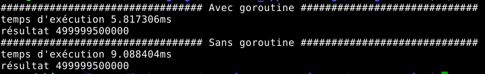

# TD2 Exercice 4 : Solution 

Pour réaliser cet exercice, il faut faire attention au fait qu'il faut bien attendre que toutes les goroutines se soient terminées. Il faut donc une variable de synchronisation. Les deux fonctions avec et sans goroutine sont très proches : 

```go
// Variable permettant de synchroniser les goroutines.
var wg sync.WaitGroup

// Calcul de la factorielle avec les goroutines. 
var somme_goroutine int

// Calcul de la factorielle sans les goroutines. 
var somme int

// Fonction qui calcule la factorielle de 1000000 en utilisant les goroutines. 
func factorielle_goroutine() {
    for i := 0; i < 1000000; i++ {
        somme_goroutine += i
    }
    wg.Done()
}

// Fonction qui calcule la factorielle de 1000000 sans utiliser les factorielles. 
func factorielle() {
    for i := 0; i < 1000000; i++ {
        somme += i
    }
}

// Fonction main qui fait la comparaison entre la factorielle avec/sans goroutines. 
func main() {
    fmt.Println("################################# Avec goroutine #############################")
    start := time.Now()
    wg.Add(1)
    go factorielle_goroutine()
    wg.Wait()
    fmt.Println("temps d'exécution", time.Since(start))
    fmt.Println("résultat", somme_goroutine)
    
    fmt.Println("################################# Sans goroutine #############################")
    start2 := time.Now()
    factorielle()
    fmt.Println("temps d'exécution", time.Since(start2))
    fmt.Println("résultat", somme)
}
```

Quand on exécute le programme, on peut voir que l'exécution avec goroutine est beaucoup plus rapide que celle sans : 



Pour avoir le code complet : [exo2.4](exo2.4.zip)

