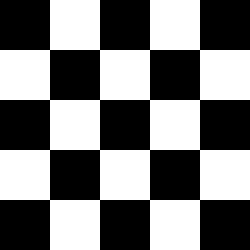
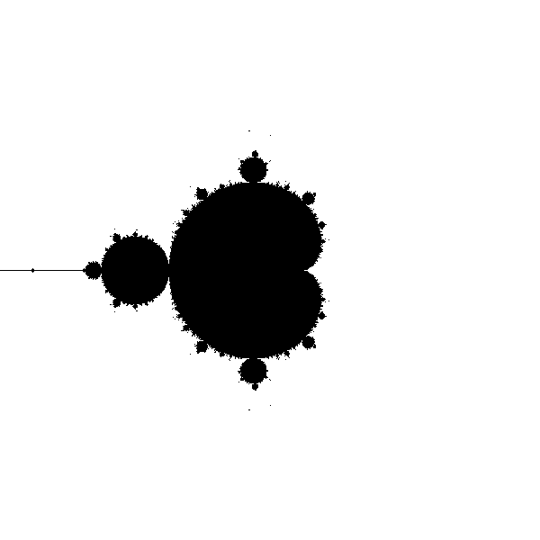

# TD3 Exercice 1 : Solution 

Q1) On va créer une fonction qui prend en paramètre le chemin de l'image à créer et qui va dessiner le damier. Cette fonction va renvoyer 0 si l'image a été créée correctement et 1 sinon : 

```go 
// Fonction qui dessine un damier
func dessineDamier(path string) int{
    // on va utiliser 2 couleurs pour le damier : blanc et noir
    var couleur[2] color.RGBA
    couleur[0]=color.RGBA{0,0,0,255}
    couleur[1]=color.RGBA{255,255,255,255}

    bordure:= 250
    //déclaration de l'image qui sera de taille 250x250 pixels
    damier := image.NewRGBA(image.Rect(0, 0, bordure, bordure))

    var swap_color int = 0
    // dessin des cases du damier qui auront une taille de 50 pixels
    for x := 0; x< 250; x=x+50 {
        for y :=0 ; y<250; y=y +50 {
            draw.Draw(damier, image.Rect(x, y, x+50,y+50 ), &image.Uniform{couleur[swap_color]}, image.ZP, draw.Src)
            swap_color=1 - swap_color
        }
    }

    // création du fichier avec le chemin choisi par l'utilisateur
    myfile, err1 := os.Create(path)
    if err1 != nil {
        return 1
    }

    // écriture de l'image dans le fichier
    err2 := png.Encode(myfile, damier)
    if err2 != nil {
        return 1
    }

    return 0
}
```

On crée maintenant la fonction principale qui récupère ce que l'utilisateur veut comme chemin : 

```go
func main(){
    arg := os.Args[1:]
    if len(arg) == 0 {
        fmt.Println("Aucun argument. ")
    }else {
        err := dessineDamier(arg[0])
        if err == 1 {
            fmt.Println("Impossible de dessiner le damier. ")
        }else{
            fmt.Println("Dessin du damier effectué. ")
        }
    }
}
```
Par exemple, pour créer une image png `damier.png` dans le dossier courant, on fait la commande suivante : `./damier ./damier.png`.
Et on obtient l'image suivante : 



Q2) D'abord, on crée une fonction qui crée un dessin et qui l'encode dans un fichier : 

```go
// Réalise le dessin
func dessineMandelbrot(path string) int{
    // Initialisation du dessin
    bordure:= 600
    dessin_png := image.NewRGBA(image.Rect(0, 0, bordure, bordure))
    var couleur color.RGBA
    couleur=color.RGBA{255,255,255,255}
    draw.Draw(dessin_png, image.Rect(0, 0, bordure,bordure), &image.Uniform{couleur}, image.ZP, draw.Src)

    // Dessin de chaque pixel
    for x := 0 ; x<Bordure ; x++{
        i:=float64(x)/Bordure*(Xmax - Xmin) + Xmin
        for y := 0 ; y<Bordure ;y++{
            j:=float64(y)/Bordure*(Ymax - Ymin) + Ymin
            c := complex(i,j)
            dessin_png.Set(x,y,mandelbrot(c))
        }
    }
    
    // Ecriture dans le fichier
    fichier, err := os.Create(path)
    if err != nil {
        return 1
    }
    png.Encode(fichier, dessin_png)
    return 0
}
```

Ensuite, on crée la fonction qui dessine les pixels de la fractale : 

```go
// Dessin des pixels de la fractale de Mandelbrot 
func mandelbrot(c complex128) color.Color {
   var z complex128
    for n := 0; n< ItérationMax; n++ {
        z=z*z+c
        if cmplx.Abs(z)> BorneModule {
            return color.RGBA{255,255,255,255}
        }
    }
    return color.Black
}
```

Enfin, on veut gérer la gestion des commandes de l'utilisateur afin de récupérer le chemin du fichier choisi par l'utilisateur : 

```go
// Fonction principale
func main() {
    arg := os.Args[1:]
    if len(arg) == 0 {
        fmt.Println("Aucun argument. ")
    }else {
        err := dessineMandelbrot(arg[0])
        if err == 1 {
            fmt.Println("Impossible de dessiner la fractale. ")
        }else{
            fmt.Println("Dessin de la fractale effectué. ")
        }
    }
}
```

Par exemple, pour créer une image png `mandelbrot.png` dans le dossier courant, on fait la commande suivante : `./mandelbrot ./mandelbrot.png`.
Et on obtient l'image suivante : 



Pour avoir le code complet : [exo3.1](exo3.1.zip)